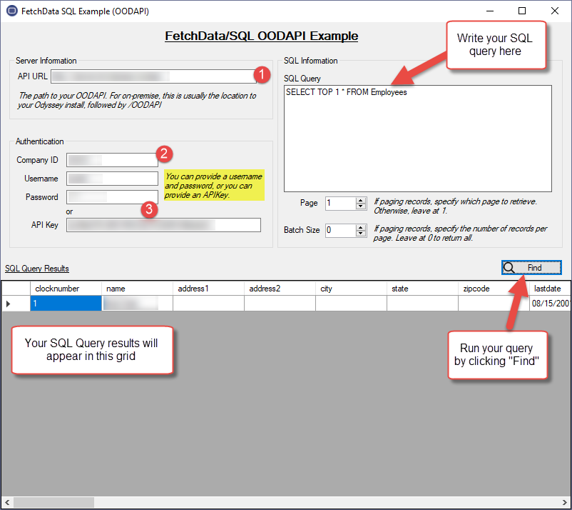

# FetchData/SQL Example

This example application shows how to query the `OODAPI` via the `FetchData/SQL `method. This is a WinForms graphical application that allows you to enter an SQL query into a textbox and immediately see its results.

This information is intended for Odyssey administrators or developers who wish to understand how to use the `OODAPI`, and the `FetchData/SQL` method, in C# code.

# Requirements

* Windows PC with `.NET Framework 4.6`
* `Visual Studio 2017` or newer

# Setup

*  Download this project, then open the `FetchDataSQL.sln` file
*  Build the solution
*  Run the solution by pressing F5

# Usage

In the interface, you'll need to specify a few pieces of information.

  

1.  The URL to your OODAPI, such as `http://my-server/odyssey/oodapi`.
2.  The CompanyID you are logging into or using.
3.  A `Username/Password` combination, or an `APIKey`
    *  Note that if you have an `APIKey` you've already generated in Odyssey, you can use it here instead of a username / password. Otherwise, by specifying a username / password, the application will generate a temporary `APIKey` using the `/Login` OODAPI procedure

Once you have defined the information above, you can now press the `Find` button. It will either login as the specified user and generate an APIKey, or it will use the specified APIKey. It will perform the SQL Query that is currently entered and show its results in a grid at the bottom of the screen.

# About
[support@blinfo.com](support@blinfo.com)  
[B&L Information Systems](https://www.blinfo.com)  
  